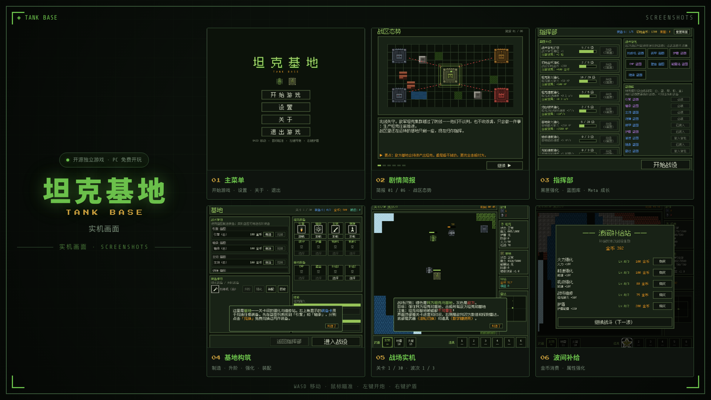
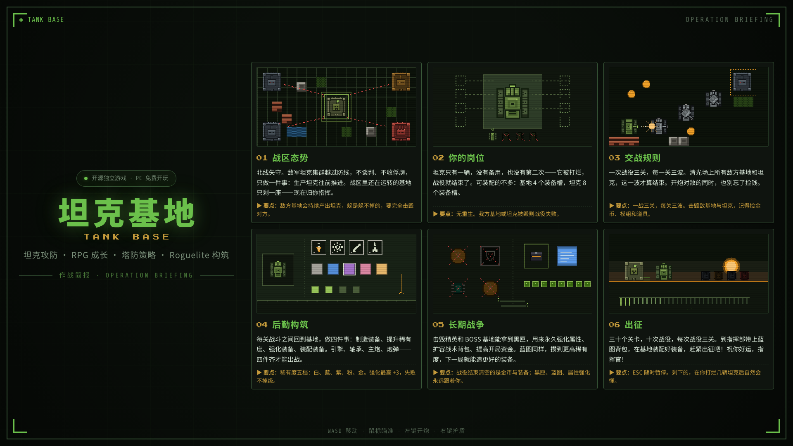
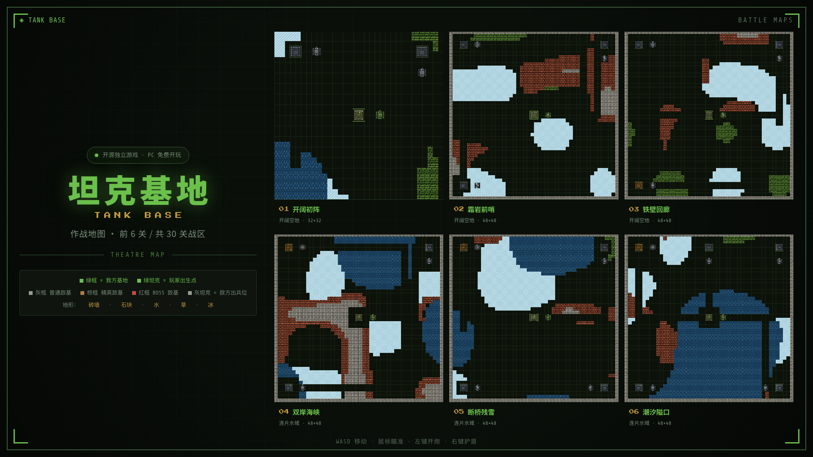

# 🎮 坦克基地

北线失守，敌方坦克逼近，战区最后一座基地归你指挥！驾驶唯一的一辆坦克，一战三关、一关三波，击毁敌方坦克和基地；战后回基地制造、升阶、强化装备，用黑匣永久变强。祝你好运，指挥官！

《坦克基地》是一款融合 RPG、塔防与 Roguelite 元素的俯视角坦克攻防游戏，欢迎免费开玩。

**👉 [游戏下载](https://github.com/monetgames/TankBase/releases)**


## 🕹️ 玩法

- **一战三关，每关三波**：每波开始，敌方基地在光标处显现并开始生产坦克；击毁战场所有敌方基地和坦克，这一波才算结束。
- **无重生**：我方坦克或基地被毁，战役即告失败，整场战役重打。
- **后勤构筑**：关卡之间回到基地制造装备、装备升阶与强化；13 种装备、5 档稀有度、3 档强化等级。
- **30 个关卡**：5 种地形块为基础，使用柏林噪声算法和人工关卡编排，形成特色关卡地图。
- **循环挑战**：使用战役获得的黑匣解锁更强的起步构筑；通过 30 关后进入循环挑战，考验构筑上限。

## 📸 预览

### 实机画面


### 作战简报


### 作战地图


## 🚀 从源码运行

1. 安装 [Godot 4.7](https://godotengine.org/download)（Godot 4.4+，GDScript 标准版）。
2. 克隆仓库（含 MCP 插件子模块）：

   ```bash
   git clone --recursive https://github.com/monetgames/TankBase.git
   ```

3. 用 Godot 打开 `project.godot`，按 F5 运行。

## 🤖 用 AI 开发本项目（godot-mcp-bridge）

本项目支持使用 [godot-mcp-bridge](https://github.com/monetgames/godot-mcp-bridge) 开发：MCP server（`npx godot-mcp-bridge`）+ 编辑器插件（`addons/godot_mcp` git 子模块），AI Agent 可以直接读写场景与脚本、运行游戏并截图、校验脚本编译、驱动运行中的游戏。使用说明见 [.agents/skills/godot-mcp-bridge/](.agents/skills/godot-mcp-bridge/SKILL.md)。

## 📁 目录结构

| 目录/文件 | 内容 |
|---|---|
| `scripts/` | 全部 GDScript：`autoload/` 全局单例（存档、经济、装备、掉落、波次等），根目录为实体/流程脚本 |
| `scenes/` | 场景文件（.tscn），逻辑全部在 `scripts/` |
| `config/` | 数值配置 JSON，**改这里就能调游戏数值**，说明见 [config/README.md](config/README.md) |
| `maps/` | 关卡地图 JSON |
| `sprites/` `themes/` `fonts/` | 美术资源、UI 主题、像素字体 |
| `addons/godot_mcp/` | godot-mcp-bridge 编辑器插件（git 子模块） |
| `tools/` | 开发期脚本：关卡地图、装备图标、剧情立绘等资源的生成 |
| `.agents/` | AI agent 使用说明（skill） |

## 💬 社区

微信公众号：**莫奈奈**


## 📄 协议

本项目以 [GNU GPL v3.0](LICENSE) 协议开源：你可以自由使用、学习、修改和再分发，但**衍生作品必须同样以 GPL v3.0 开源**；商用不受限制，保留版权与许可声明即可。第三方组件遵循各自的开源协议。
